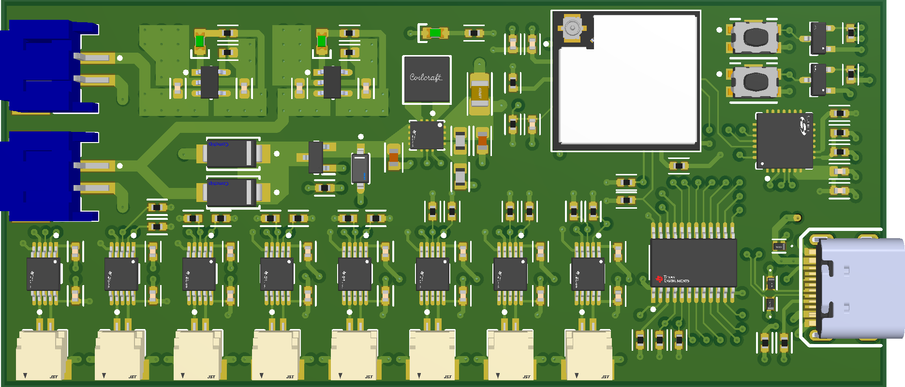
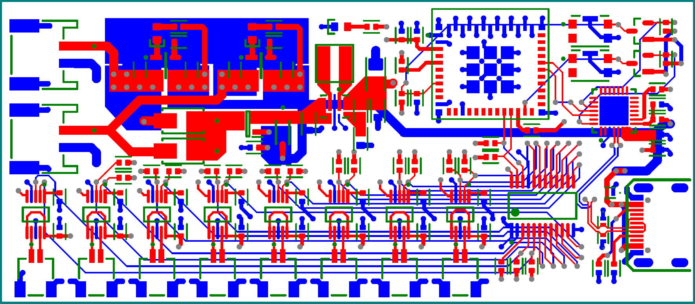

# PCB V2 : Conception, Objectifs et Stackup

La **version 2** du schéma électrique se concrétise sous forme d’un **PCB 4 couches** destiné à faire la transition entre le *prototype* et un *produit fini*. Cette carte, d’une dimension de **8 cm x 3,5 cm**, intègre tous les éléments nécessaires pour rendre l’ensemble **autonome** (réseaux d’alimentation, bus de communication, microcontrôleur, etc.), conformément au **schéma V2**.

## Stackup et routage
Ce PCB respecte le **stackup [JLC04161H-3313](https://jlcpcb.com/)** de JLCPCB :

- **Couches extérieures** : dédiées aux **signaux** (pistes de communication, contrôle, etc.).  
- **Couches intérieures** : l’une sert de **plan de masse (GND)** et l’autre est réservée à l’**alimentation 3,3 V**.

Cette conception multicouche facilite le routage, améliore la **distribution de l’alimentation** et renforce la **protection contre les interférences**. Grâce à cette architecture, le PCB peut accueillir et alimenter correctement tous les composants indispensables au fonctionnement de la manchette haptique, tout en demeurant compact et fiable.

