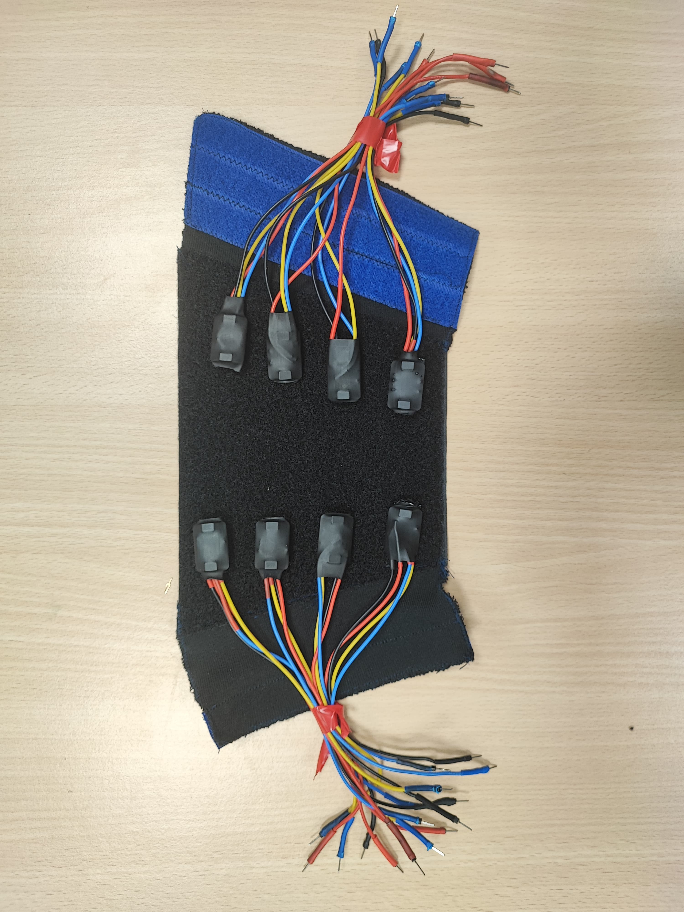
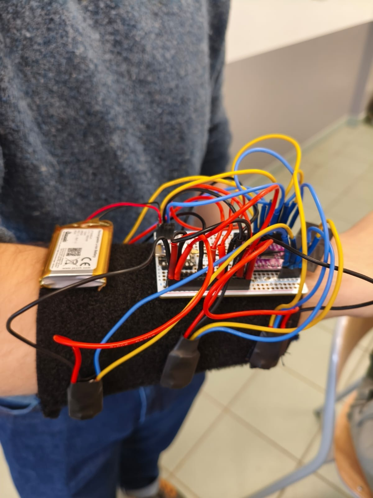

# Prototype de Manchette Haptique

Ce prototype est une **manchette** équipée de **8 moteurs** haptiques (DRV2605L) et conçue pour être **modulable** grâce à son système **Velcro**. Son but est de tester diverses configurations (position des moteurs, patterns de vibrations) et de valider les choix technologiques pour un futur produit fini.

---

## Conception et matériaux

1. **Structure de la manchette**  
   - Réalisée en **tissu** cousu, intégrant des bandes **Velcro** pour un ajustement rapide et la modularité des positions de moteurs.  
   - La fermeture en **Velcro** facilite la pose et le retrait du dispositif sur l’utilisateur, tout en permettant de repositionner aisément les moteurs à différents endroits du bras.  

2. **Moteurs et drivers**  
   - **8 moteurs** haptiques (un par DRV2605L).  
   - Connectés et soudés sur des **drivers DRV2605L**, eux-mêmes reliés à la ligne I2C via un **multiplexeur TCA9548A**.  
   - Chaque moteur est gainé avec de la **thermo-rétractable** pour sécuriser la soudure et protéger l’électronique contre l’usure.  

:::info
Les cables jaunes sont les signaux SCL et les cables bleus sont les signaux SDA.
:::

3. **Alimentation**  
   - Utilisation d’une **batterie** (type Li-ion ou Li-Po selon le besoin) pour offrir une autonomie suffisante lors des tests.  

:::info
Il est possible de connecter plusieurs batteries en parallèle pour augmenter l’autonomie.
:::

4. **Carte principale**  
   - Montage sur une **plaque d’essais**.  
   - L’**ESP32** et le **multiplexeur TCA9548A** y sont soudés/fixés, puis reliés aux drivers DRV2605L par des câbles de liaison.  
   - L’ESP32 assure la gestion WiFi, la communication MQTT et la commande I2C des moteurs.  

---

## Objectifs et avantages

- **Modularité** : Le Velcro permet de placer les moteurs à différentes positions sur le bras, ce qui est essentiel pour étudier l’impact de la localisation de la vibration.  
- **Rapidité de test** : Grâce à la batterie embarquée et la conception “tout-en-un” (moteurs, drivers, ESP32), il est facile de faire des essais de patterns sans station fixe.  
- **Évolutivité** : Le multiplexeur TCA9548A autorise jusqu’à 8 canaux I2C distincts, facilitant l’ajout ou le retrait de moteurs selon les besoins.

---

## Conclusion

Ce prototype **offre un terrain d’expérimentation** pour évaluer différentes configurations de vibrations haptiques. La manchette, avec ses **8 moteurs DRV2605L** modulables en position, permet de tester non seulement la **conception matérielle** (ergonomie, robustesse), mais aussi la **conception logicielle** (patterns de vibration, fréquence, intensité). Il constitue ainsi une **base solide** pour valider les choix et améliorer le produit final en conditions réelles.

