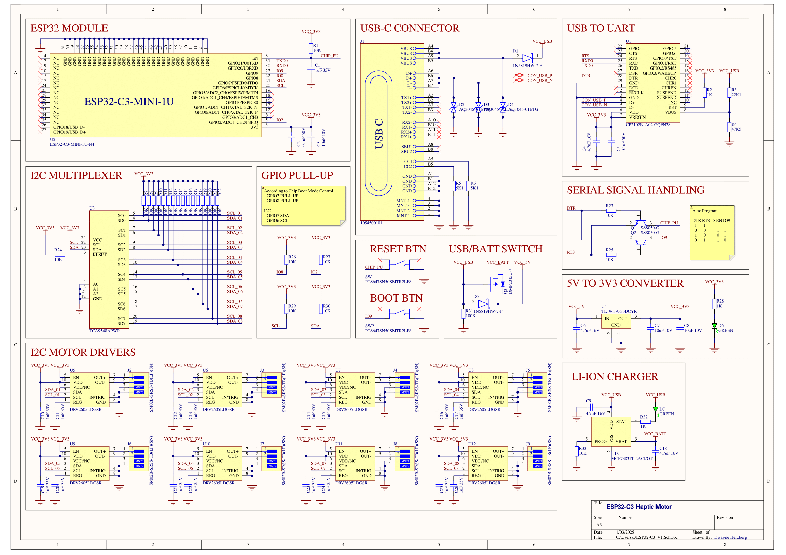

# Circuit Design V1

## Présentation Générale

Le schéma électrique présenté ci-dessus décrit la conception détaillée d'un système basé sur l'ESP32-C3 pour le contrôle des moteurs haptiques. Il s'agit d'une architecture qui intègre un microcontrôleur, des drivers I²C, des moteurs haptiques, ainsi qu'une gestion complète de l'alimentation et de la communication.

Le système repose sur une architecture modulaire et robuste pour piloter des moteurs haptiques avec précision. Il est alimenté par une source d’énergie flexible (USB-C ou batterie LiPo) avec une gestion de puissance qui assure une transition automatique entre ces deux sources. Le microcontrôleur ESP32-C3 est chargé de gérer les communications réseau via MQTT, d’interpréter les commandes et de contrôler les moteurs haptiques à travers des drivers connectés via un multiplexeur I²C.

Les instructions reçues par le réseau sont transmises aux moteurs haptiques pour générer des vibrations correspondant aux commandes. L’utilisation de composants standardisés, tels que l’I²C et l’USB, garantit une simplicité de conception et une disponibilité immédiate des pièces nécessaires pour le prototypage et la production.

---

## Description des Blocs

### ESP32 Module

Le microcontrôleur **ESP32-C3-MINI-1U** constitue l'élément central du système, orchestrant la gestion des communications, le contrôle des moteurs haptiques et l'intégration réseau. Ce modèle, basé sur une architecture RISC-V 32 bits cadencée à 160 MHz, offre des performances élevées tout en maintenant une faible consommation énergétique

Le choix de l’ESP32-C3 s'explique par la réputation d’Espressif en matière de microcontrôleurs robustes et largement adoptés dans les projets IoT. La gamme ESP32 bénéficie d'une documentation riche, d'un support logiciel étendu (Espressif IDF et Arduino), et d'une communauté active, ce qui facilite son intégration et réduit les délais de développement. En particulier, le modèle C3 se distingue par sa compatibilité avec le Wi-Fi (802.11 b/g/n) et le Bluetooth Low Energy (BLE 5.0).

Les broches GPIO de l'ESP32-C3 sont configurées pour :

- La communication I²C, utilisée pour piloter les drivers haptiques via les lignes SDA et SCL.
- Le basculement entre les modes normal et bootloader grâce aux signaux DTR et RTS, reliés au convertisseur USB-to-UART, permettant ainsi un flashage du firmware simple et rapide.

Enfin, l'intégration d'une antenne externe via un connecteur **U.FL** garantit une connexion réseau stable et fiable, même dans des environnements sujets à des interférences ou à une couverture Wi-Fi limitée.

---

### USB-C Connector
Le connecteur USB-C assure une double fonction : l'alimentation du système et la recharge de la batterie LiPo. Conforme aux spécifications USB 2.0, il délivre une tension de 5V avec un courant maximal de 500 mA. Les lignes d’alimentation sont protégées contre les surtensions par des diodes TVS.

---

### USB-to-UART
Le convertisseur **CP2102N** est utilisé pour gérer la communication série entre le microcontrôleur et un PC hôte. Il permet également le flashage du firmware via les broches EN et GPIO9 de l'ESP32-C3. Ce composant offre des protections ESD pour sécuriser les lignes de données et assure des transferts stables jusqu’à 3 Mbps.

---

### Gestion de l'Alimentation
#### Chargeur LiPo
Le **MCP73831** est un circuit de charge configuré en mode courant constant/tension constante (CC/CV). Il recharge une batterie LiPo 1S (3,7V nominal) et assure une coupure à 4,2V pour protéger la batterie et prolonger sa durée de vie. Une LED indique l'état de charge.

#### Commutation USB/Batterie
Un circuit basé sur des MOSFET canal P garantit une transition automatique entre l’alimentation USB et la batterie. Lorsque l’USB est branché, il alimente directement le circuit tout en rechargeant la batterie. En cas de débranchement, la batterie prend immédiatement le relais sans interruption.

#### Régulateur de Tension
Le **TL1963A** convertit la tension de 5V en 3,3V pour alimenter les composants sensibles. Avec une capacité de sortie jusqu’à 1,5 A et une faible ondulation, il assure une alimentation stable, même en cas de variations de charge.

---

### I²C Multiplexer
Le **TCA9548A** permet au microcontrôleur d’accéder à plusieurs drivers haptiques ayant une adresse I²C fixe. Ce multiplexeur possède 8 canaux, chacun activé indépendamment par des commandes envoyées via le bus principal.

---

### I²C Motor Drivers

Voici une version plus détaillée sur le **DRV2605L**, expliquant ses fonctionnalités et avantages :

---

### Drivers Haptiques : DRV2605L

Le **DRV2605L** est utilisé pour piloter chaque moteur haptique, qu’il soit linéaire (LRA) ou rotatif (ERM). Il offre un contrôle précis des vibrations.

#### Fonctionnalités principales

1. **Profils de vibration intégrés**  
   Le DRV2605L dispose de **123 profils prédéfinis** pour générer des vibrations variées. Il permet également de programmer des effets personnalisés via le bus I²C.

2. **Rétroaction dynamique**  
   Grâce à un mode en boucle fermée, le driver ajuste automatiquement les vibrations pour maintenir une amplitude stable, quelle que soit la charge mécanique du moteur.

3. **Détection de résonance (LRA)**  
   Le driver détecte automatiquement la fréquence optimale des moteurs linéaires, améliorant les performances.

4. **Commandes flexibles**  
   Outre le contrôle via I²C, il accepte des signaux PWM ou analogiques pour une intégration polyvalente.

5. **Mode veille à faible consommation**  
   Lorsque le driver n’est pas actif, il réduit automatiquement sa consommation énergétique.

#### Alimentation et intégration

Le DRV2605L est alimenté en **3,3V**, compatible avec le régulateur du système. Il est connecté au multiplexeur **TCA9548A** pour permettre un contrôle individuel de chaque moteur sans conflits d’adresses.

---

### Moteurs Haptiques
Les moteurs utilisés, de type **ERM**, fonctionnent à une tension nominale de 3,7V et offrent une vitesse de 9 000 tours par minute avec un courant nominal de 120 mA. Ces moteurs restent stables dans une plage de tension comprise entre 2,5V et 4,3V.