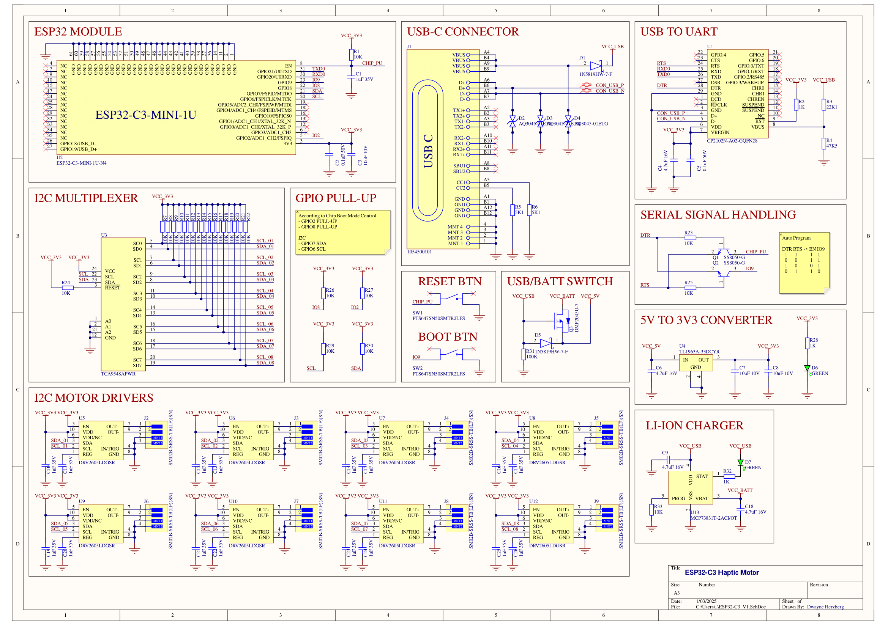

# Conception du Circuit V1

Ce document présente un circuit électronique construit autour de l’ESP32-C3 pour contrôler plusieurs moteurs haptiques, alimentés à la fois par USB-C et batterie LiPo. Le schéma inclut la gestion d’alimentation, un multiplexeur I²C pour les pilotes haptiques et un convertisseur USB-to-UART (CP2102N) afin de faciliter la programmation et la communication.

## Vue d’Ensemble

L’ESP32-C3 assure la réception des commandes (par Wi-Fi ou BLE) et la gestion du bus I²C vers les pilotes haptiques (DRV2605L). Le multiplexeur TCA9548A évite tout conflit d’adresses lorsqu’il y a plusieurs pilotes identiques. Un module de charge (MCP73831) et des MOSFET canal P garantissent la commutation automatique entre l’USB et la batterie LiPo. Le régulateur TL1963A fournit ensuite un 3,3 V stable à l’ESP32-C3 et aux autres composants.

## ESP32-C3 et USB-to-UART

Le cœur du système s’appuie sur le **module ESP32-C3-MINI-1U**, qui intègre un microcontrôleur ESP32-C3 (architecture RISC-V à 32 bits) avec le Wi-Fi et le Bluetooth Low Energy déjà configurés, ainsi qu’un connecteur U.FL pour antenne externe. L’utilisation de ce module, plutôt que la puce ESP32-C3 à l’état brut, simplifie la conception et garantit une meilleure fiabilité grâce à ses certifications et à la gestion d’antenne déjà validées.

Pour la programmation et la communication série, le module est relié au **convertisseur USB-to-UART (CP2102N)**. Les signaux DTR et RTS de ce convertisseur sont connectés aux broches de boot et de reset du module, autorisant un reflashage de l’ESP32-C3 sans manipulation supplémentaire. Les broches SDA et SCL du module gèrent le bus I²C, tandis que d’autres GPIO peuvent être attribuées à des fonctions complémentaires (capteurs, indicateurs, etc.).

:::tip
Pour plus de détails sur l’ESP32-C3 et ses modules, consultez la [documentation ESP32-C3](https://www.espressif.com/sites/default/files/documentation/esp32-c3_datasheet_en.pdf) ou la [documentation des modules ESP32-C3-MINI](https://www.espressif.com/sites/default/files/documentation/esp32-c3-mini-1_datasheet_en.pdf).
:::

## Alimentation et Gestion de la Batterie

Le connecteur USB-C délivre 5 V pour alimenter le circuit et recharger la batterie LiPo. Des diodes TVS protègent les lignes contre les surtensions. Le MCP73831 assure la régulation de charge en mode courant constant/tension constante, avec une LED indiquant l’état. Une fois la batterie à 4,2 V, la charge est coupée pour préserver sa longévité.

La commutation USB/Batterie s’effectue par des MOSFET canal P, basculant automatiquement selon la présence ou l’absence de l’alimentation USB. Le régulateur TL1963A convertit ensuite le 5 V en 3,3 V, pouvant fournir jusqu’à 1,5 A si nécessaire.

:::caution
Surveillez la dissipation thermique et adaptez les radiateurs ou plans de masse selon le courant total demandé par l’ESP32-C3 et les moteurs.
:::

## Multiplexeur I²C (TCA9548A)

Plusieurs pilotes DRV2605L partagent la même adresse I²C par défaut. Pour éviter les conflits, le TCA9548A propose huit canaux distincts. L’ESP32-C3 active le canal désiré en écrivant dans un registre. Chaque pilote est ainsi isolé sur son propre canal, sans adresser simultanément le même composant.

Le multiplexeur s’alimente en 3,3 V et s’intègre facilement sur le bus I²C existant. Logiciellement, l’activation d’un canal ne demande qu’une écriture simple dans le registre de contrôle.

:::warning
Le multiplexeur TCA9548A requiert des resistances de pull-up sur l'ensemble des lignes SDA et SCL. Pour plus de détails, consultez la [documentation du TCA9548A](https://www.ti.com/lit/ds/symlink/tca9548a.pdf).
:::

## Pilotes Haptiques (DRV2605L)

Les DRV2605L pilotent des moteurs ERM ou LRA en créant des signaux de vibration. Ils proposent des effets prédéfinis et peuvent également générer des vibrations personnalisées. Le mode de détection de résonance convient aux LRA, tandis que les ERM classiques sont contrôlés par un simple registre d’excitation.

Chaque pilote fonctionne en 3,3 V et se met en veille lorsqu’il n’est pas utilisé. Cette fonctionnalité limite la consommation globale et assure une bonne autonomie sur batterie.

:::info
La [documentation du DRV2605L](https://www.ti.com/lit/ds/symlink/drv2605l.pdf) fournit la liste complète des effets de vibration et explique comment les configurer en I²C.
:::

## Moteurs ERM et Intégration

Les moteurs ERM choisis (3,7 V nominal) produisent un courant autour de 120 mA chacun. Ils offrent une vibration satisfaisante à des vitesses avoisinant 9 000 tr/min.

## Programmation et Débogage

Le CP2102N connecte l’ESP32-C3 à un hôte via USB, facilitant la programmation avec `esptool.py` ou l’IDE Arduino. Les signaux DTR et RTS se chargent automatiquement de la séquence de mise en mode Bootloader, sans appui sur un quelconque bouton. Le même convertisseur sert de console série pour afficher des logs ou effectuer des tests de communication.

## Références

- [ESP32-C3 Datasheet](https://www.espressif.com/sites/default/files/documentation/esp32-c3_datasheet_en.pdf)  
- [CP2102N Datasheet (Silicon Labs)](https://www.silabs.com/documents/public/data-sheets/cp2102n-datasheet.pdf)  
- [MCP73831 Datasheet (Microchip)](https://ww1.microchip.com/downloads/en/DeviceDoc/20001984g.pdf)  
- [TL1963A Datasheet (Texas Instruments)](https://www.ti.com/lit/ds/symlink/tl1963a.pdf)  
- [TCA9548A Datasheet (Texas Instruments)](https://www.ti.com/lit/ds/symlink/tca9548a.pdf)  
- [DRV2605L Datasheet (Texas Instruments)](https://www.ti.com/lit/ds/symlink/drv2605l.pdf)

