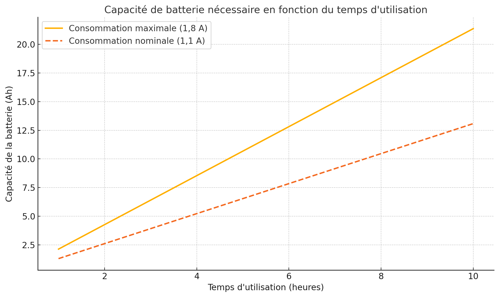

# Dimensionnement de la Batterie pour le TPS62827DMQ

## Scénario pire cas : Consommation maximale du système (1,8 A)

Déterminer la capacité nécessaire d’une batterie **LiPo 1S** pour alimenter le régulateur **TPS62827DMQ**, délivrant **3,3 V à 1,8 A** pendant au moins **3 heures**.

### 1. Puissance requise à la sortie
La puissance de sortie est calculée par :
$$
P_{\text{out}} = V_{\text{out}} \times I_{\text{out}}
$$

- $$ V_{\text{out}} = 3,3 \, \text{V} $$
- $$ I_{\text{out}} = 1,8 \, \text{A} $$

$$
P_{\text{out}} = 3,3 \times 1,8 = 5,94 \, \text{W}
$$

### 2. Considération du rendement
Avec un rendement ($$\eta$$) estimé à **90 %**, la puissance nécessaire en entrée devient :
$$
P_{\text{in}} = \frac{P_{\text{out}}}{\eta}
$$

$$
P_{\text{in}} = \frac{5,94}{0,9} \approx 6,6 \, \text{W}
$$

### 3. Courant requis par la batterie
Pour une batterie **1S LiPo** avec une tension nominale de **3,7 V** :
$$
I_{\text{batt}} = \frac{P_{\text{in}}}{V_{\text{batt}}}
$$

$$
I_{\text{batt}} = \frac{6,6}{3,7} \approx 1,78 \, \text{A}
$$

### 4. Capacité requise de la batterie
Pour garantir une autonomie de **3 heures**, la capacité nécessaire est :
$$
C_{\text{batt}} = I_{\text{batt}} \times \text{Temps}
$$

$$
C_{\text{batt}} = 1,78 \times 3 \approx 5,34 \, \text{Ah}
$$

### 5. Ajout d’une marge de sécurité
En ajoutant une **marge de 20 %** pour tenir compte des pertes et de l’usure :
$$
C_{\text{batt, ajustée}} = C_{\text{batt}} \times 1,2
$$

$$
C_{\text{batt, ajustée}} = 5,34 \times 1,2 \approx 6,4 \, \text{Ah}
$$

### Résultat

Une batterie **1S LiPo** avec une capacité minimale de **6,4 Ah** est requise pour alimenter le système pendant **3 heures**.

---

## Scénario alternatif : Consommation nominale du système (1,1 A)

Dans ce scénario, la consommation est réduite à **1,1 A**.

### 1. Puissance de sortie :

$$
P_{\text{out}} = 3,3 \times 1,1 = 3,63 \, \text{W}
$$

### 2. Puissance en entrée :

$$
P_{\text{in}} = \frac{3,63}{0,9} \approx 4,03 \, \text{W}
$$

### 3. Courant de la batterie :

$$
I_{\text{batt}} = \frac{4,03}{3,7} \approx 1,09 \, \text{A}
$$

### 4. Capacité de la batterie :

$$
C_{\text{batt}} = 1,09 \times 3 \approx 3,27 \, \text{Ah}
$$

### 5. Marge de sécurité :

$$
C_{\text{batt, ajustée}} = 3,27 \times 1,2 \approx 3,92 \, \text{Ah}
$$

### Résultat

Une batterie **1S LiPo** de **4 Ah** est necessaire pour alimenter le système pendant **3 heures**.

---

## Choix de la Batterie

La batterie **LP103450JH+PCM+PTC+2 WIRES 70MM** a été choisie car elle offre un bon équilibre entre capacité et taille. Avec une capacité de 1,92 Ah et des dimensions compactes (52 x 34,5 x 10,8 mm).

Pour augmenter l’autonomie, deux ou trois batteries peuvent être utilisées en parallèle. Cela permet d’obtenir une capacité totale de 3,84 Ah ou 5,76 Ah, selon les besoins. Cette modularité garantit une alimentation suffisante pour les scénarios à forte consommation tout en conservant un format compact.

Enfin, cette batterie intègre un système de protection contre les surtensions, sous-tensions et surintensités, offrant ainsi fiabilité et sécurité pour le système. Elle représente une solution efficace et adaptée au projet.