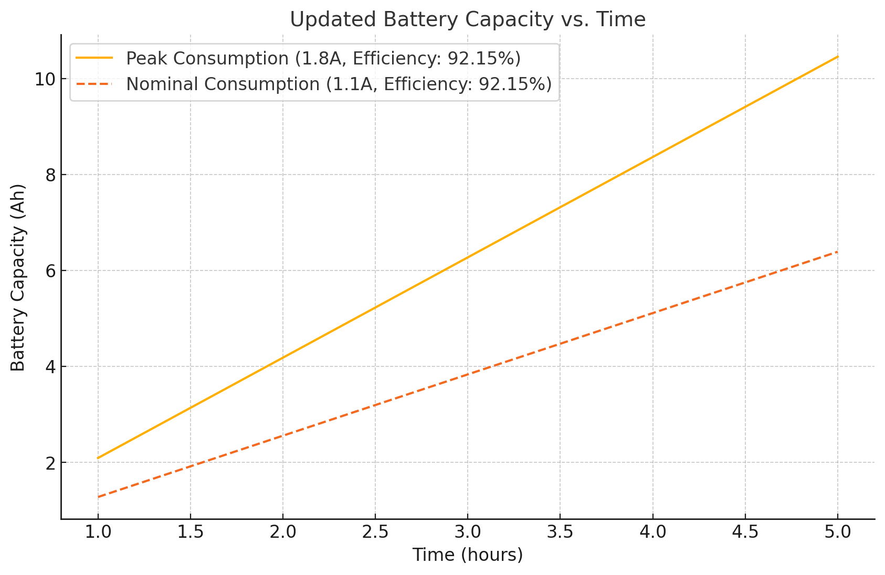

# Évaluation de la Capacité Batterie

Ce document détaille le dimensionnement d’une batterie LiPo pour alimenter un circuit à **3,3 V** via le régulateur **TPS630250RNCT**. Deux scénarios sont considérés : un pic de charge (1,8 A pendant 3 h) et un fonctionnement nominal (1,1 A pendant 3 h). Un graphique, inséré un peu plus bas, illustre la corrélation entre la capacité de la batterie et le temps d’utilisation pour ces deux situations.

## Choix du Régulateur

Le composant **TPS630250RNCT** a été sélectionné à l’aide de l’outil en ligne [WEBENCH® Power Designer de Texas Instruments](https://webench.ti.com/power-designer/). Cet outil compare les régulateurs selon leur rendement, leur plage de tensions d’entrée et de sortie, et leur courant maximal. Dans notre cas, le TPS630250RNCT offre une bonne combinaison de rendement (environ 92,15 % typique) et de capacité à maintenir 3,3 V sur une tension de batterie variant autour de 3,7 V (1S LiPo).

:::note
Consultez la fiche générée par WEBENCH® pour des informations plus précises sur le dimensionnement des composants passifs et sur les performances du régulateur. **[PDF](./WBDesign.pdf)**
:::

## Méthodologie de Calcul

Les calculs s’appuient sur :
- La **puissance de sortie** (3,3 V)  
- L’**efficacité** typique du TPS630250RNCT (92,15 %)  
- La **tension nominale** d’une batterie LiPo 1S (3,7 V)  
- Une **marge de sécurité** de 20 %

Le but est d’estimer l’autonomie pour 3 heures de fonctionnement dans deux scénarios, en déduisant la capacité requise (en Ah).

### Scénario 1 : Pire Cas (1,8 A pendant 3 h)

1. **Puissance en sortie**  
   $$
   P_{\text{out}} = V_{\text{out}} \times I_{\text{out}} = 3.3 \times 1.8 = 5.94 \,\text{W}
   $$

2. **Puissance en entrée**  
   $$
   P_{\text{in}} = \frac{P_{\text{out}}}{\eta} = \frac{5.94}{0.9215} \approx 6.45 \,\text{W}
   $$

3. **Courant sur la batterie**  
   $$
   I_{\text{batt}} = \frac{P_{\text{in}}}{V_{\text{batt}}} = \frac{6.45}{3.7} \approx 1.74 \,\text{A}
   $$

4. **Capacité nécessaire**  
   $$
   C_{\text{batt}} = I_{\text{batt}} \times 3 = 1.74 \times 3 \approx 5.22 \,\text{Ah}
   $$

5. **Marge de sécurité**  
   $$
   C_{\text{batt, adjusted}} = 5.22 \times 1.2 \approx 6.26 \,\text{Ah}
   $$

:::info[**Conclusion (Pire Cas)**]
Pour soutenir 1,8 A pendant 3 heures, une batterie 1S LiPo d’environ **6,26 Ah** est recommandée.
:::

### Scénario 2 : Cas Nominal (1,1 A pendant 3 h)

1. **Puissance en sortie**  
   $$
   P_{\text{out}} = 3.3 \times 1.1 = 3.63 \,\text{W}
   $$

2. **Puissance en entrée**  
   $$
   P_{\text{in}} = \frac{3.63}{0.9215} \approx 3.94 \,\text{W}
   $$

3. **Courant sur la batterie**  
   $$
   I_{\text{batt}} = \frac{3.94}{3.7} \approx 1.06 \,\text{A}
   $$

4. **Capacité nécessaire**  
   $$
   C_{\text{batt}} = 1.06 \times 3 \approx 3.18 \,\text{Ah}
   $$

5. **Marge de sécurité**  
   $$
   C_{\text{batt, adjusted}} = 3.18 \times 1.2 \approx 3.82 \,\text{Ah}
   $$

:::info[**Conclusion (Cas Nominal)**]
Pour couvrir 1,1 A pendant 3 heures, une batterie 1S LiPo d’environ **3,82 Ah** est conseillée.
:::

## Graphique du Temps d’utilisation en fonction de la capacité

Le graphique ci-dessous représente la durée de fonctionnement selon la capacité de la batterie, pour les deux scénarios étudiés (pire cas et nominal).

La courbe supérieure (en rouge) illustre le cas nominal, moins exigeant en courant, tandis que la courbe inférieure (en bleu) représente le pire cas où l’on tire 1,8 A de manière continue.  

## Conclusion et Choix de Batterie

En tenant compte de la marge de sécurité et d’un rendement moyen d’environ 92,15 %, la capacité à prévoir varie entre 3,82 Ah (scénario nominal) et 6,26 Ah (scénario de pointe).  

Dans ce projet, nous avons finalement opté pour **deux batteries de 1,9 Ah** montées **en parallèle** (totalisant environ 3,8 Ah). Chaque batterie est **chargée individuellement**, ce qui évite les contraintes d’équilibrage et s’adapte mieux aux dimensions du produit. Cette configuration couvre la consommation nominale et reste compatible avec les contraintes d’encombrement.  

Toutefois, si des pointes de courant prolongées sont prévues, il serait prudent de prévoir un module d’alimentation supplémentaire ou d’augmenter la capacité totale en conséquence. 

:::note
Les calculs présentés ici restent théoriques et les cas présentés illustrent une utilisation continue de l'ensemble des moteurs haptiques. Cela justifie le choix d'une capacité de légèrement plus faible que ce qui est calculé ici.
:::

## Références

- [WEBENCH® Power Designer de Texas Instruments](https://webench.ti.com/power-designer/)
- [TPS630250RNCT](https://www.ti.com/lit/ds/symlink/tps630250.pdf)
- [LP103450JH+PCM+PTC+2 WIRES 70MM](https://www.digikey.fr/fr/products/detail/jauch-quartz/LP103450JH-PCM-PTC-2-WIRES-70MM/13540136)
