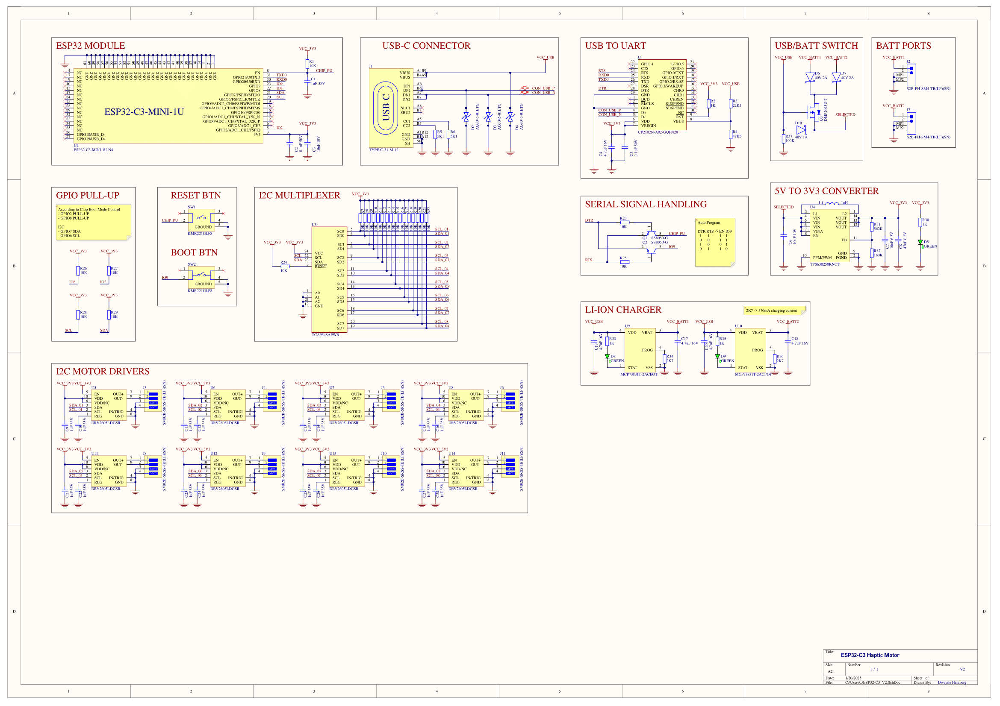

# Conception du Circuit V2

:::warning
Le circuit V2 est en cours de développement. Les informations présentées ici sont susceptibles de changer.
:::

La version V2 du circuit introduit plusieurs améliorations pour mieux répondre aux contraintes d’alimentation et de fabrication. Cette nouvelle mouture repose sur un régulateur plus puissant, une gestion de batteries remaniée et des modifications de connectique USB-C et de boutons.

## Vue d’Ensemble

1. **Régulateur Buck-Boost (TPS630250RNCT)**  
   Le précédent régulateur 1,5 A est remplacé par le **TPS630250RNCT** (2 A) pour couvrir les pics de courant.  
2. **Connecteurs de Batterie S2B-PH-SM4-TB(LF)(SN)**  
   Des connecteurs adaptés à la gamme JST-PH sont ajoutés pour faciliter le branchement des batteries.  
3. **Deux Batteries en Parallèle**  
   Le circuit prend désormais en charge deux batteries LiPo 1S (1,9 Ah chacune), branchées en parallèle pour obtenir une capacité totale d’environ 3,8 Ah.  
4. **Chargeurs Indépendants (MCP73831T-2ACI/OT)**  
   Chaque batterie dispose de son propre circuit de charge (MCP73831T-2ACI/OT), évitant ainsi les contraintes d’équilibrage et réduisant le risque de déséquilibre interne.  
5. **Connecteur USB-C Simplifié**  
   Passage d’un modèle **26 broches** à **12 broches** (moins complexe, plus facile à câbler et à assembler en production).  
6. **Boutons KMR221GLFS**  
   Les anciens boutons sont remplacés par des **KMR221GLFS**, plus compacts et adaptés à l’espace disponible.

---

## Régulateur TPS630250RNCT

La principale amélioration réside dans l’ajout d’un **régulateur buck-boost TPS630250RNCT**, capable de délivrer un courant continu jusqu’à **2 A**. Cette marge supplémentaire couvre les pics de consommation liés à l’ESP32-C3 et aux moteurs haptiques.

- **Tension d’entrée** : adaptée à une batterie LiPo 1S (3,0 V à 4,2 V) ou à l’USB (jusqu’à 5 V).  
- **Tension de sortie** : maintenue à **3,3 V** malgré les fluctuations d’alimentation.  
- **Rendement** : environ 92 % (valeur typique).

:::info
Pour plus d’informations sur le dimensionnement et l’efficacité, veuillez consulter la fiche WEBENCH® ou la [documentation TI](https://www.ti.com/product/TPS630250).
:::

## Gestion des Batteries

La V2 intègre **deux batteries 1S** (1,9 Ah chacune) placées **en parallèle**, pour une capacité totale d’environ 3,8 Ah. Un mosfet canal P combiné a des diodes schottky assure la commutation automatique entre l’USB et la batterie, sans risque de court-circuit. Les batteries sont connectées à des circuits de charge indépendants, évitant les contraintes d’équilibrage et réduisant le risque de déséquilibre interne. Chaque circuit est basé sur le **MCP73831T-2ACI/OT** de Microchip, un chargeur linéaire de batterie LiPo. Il est nécéssaire de choisir une résistance de programmation **RPROG** pour fixer le courant de charge de la batterie.

D’après la fiche technique de la batterie, le courant de charge standard (0,2 C) est de 380 mA

$$
R_{PROG} = \frac{1000}{I_{REG}} \approx \frac{1000}{380} \approx 2,63 \,\text{kΩ}
$$

Une résistance standard de **2,7 kΩ** est choisie, ce qui limite légèrement la charge sous 380 mA.

:::note
- Plus d’informations sur le dimensionnement des batteries et des chargeurs sont disponibles dans la section [Batterie](./battery.md).
- Pour plus de détails sur le MCP73831, consultez la [documentation Microchip](https://ww1.microchip.com/downloads/en/DeviceDoc/20001984g.pdf).
:::

## Connecteurs S2B-PH-SM4-TB(LF)(SN)

Des connecteurs JST-PH à 2 broches (S2B-PH-SM4-TB(LF)(SN)) ont été ajoutés pour faciliter l’insertion et le retrait des batteries. Connecteurs manquants dans la version précédente.

## Connecteur USB-C (12 broches)

Le connecteur USB-C passe d’un **26 pins** à un modèle **12 pins**, simplifiant le routage et la fabrication du câble. Les lignes essentielles (VBUS, GND, D+, D–, CC) sont conservées, tandis que les fonctions supplémentaires (SBU, SSRX, SSTX, etc.) ne sont pas utilisées dans cette application.

## Boutons KMR221GLFS

Les boutons KMR221GLFS ont été adoptés pour réduire l’encombrement sur le PCB.
