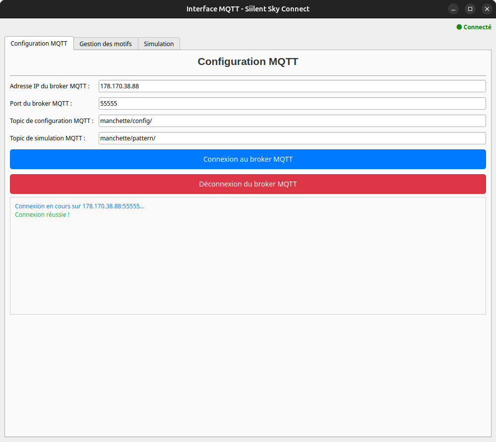

# Interface de configuration MQTT

La page **Simulation** offre une interface pour configurer l’accès au serveur MQTT, ainsi que les différents topics utilisés pour contrôler la manchette haptique selon les spécifications de l’ESP32. Plus précisément, vous pouvez y :

1. **Renseigner les paramètres MQTT**  
   - Adresse (host) du broker MQTT  
   - Port d’accès (par défaut : 55555)  
2. **Définir le topic de configuration des patterns**  
   - Par défaut, il s’agit de `/manchette/config/`.  
   - Les messages envoyés à ce topic permettent de créer ou mettre à jour des patterns en mémoire persistante sur l’ESP32.  
3. **Définir le topic d’exécution (ou “pattern execution”)**  
   - Par défaut, il s’agit de `/manchette/pattern/`.  
   - Publier le nom d’un pattern sur ce topic déclenche immédiatement son exécution sur la manchette haptique.