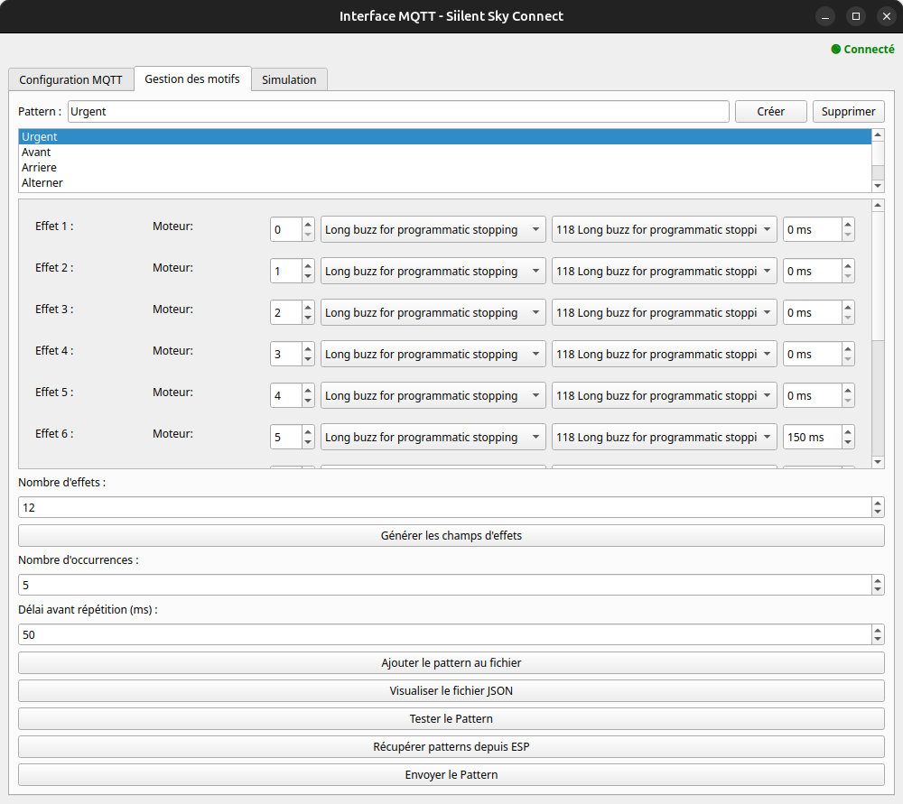

# Interface de Configuration et Création de Patterns

La page **Pattern** offre une interface pour définir, modifier et gérer vos *patterns haptiques* avant de les envoyer au firmware de la manchette haptique via MQTT. Vous pouvez ainsi créer des séquences d’effets (moteurs, intensités, délais) et choisir leur mode de répétition, le tout stocké dans un fichier JSON local ou récupéré depuis l’ESP32.

---

## Création et gestion des patterns

Pour créer un nouveau pattern, indiquez un nom dans le champ dédié (par exemple “PulseAlert”) puis cliquez sur **Créer**.  
Si vous souhaitez retirer définitivement un pattern local, sélectionnez son nom et utilisez **Supprimer**.

---

## Configuration des effets

Dans la partie “Nombre d’effets”, saisissez le nombre total de *triplets* (moteur, effet, délai) que vous souhaitez utiliser, puis cliquez sur **Générer les champs d’effets**. Chaque effet généré permet de :

1. **Choisir un moteur** (0 à 7, si vous avez huit moteurs).  
2. **Sélectionner un groupe d’effets** (ex. “Strong Buzz”, “Soft Bump”).  
3. **Définir l’effet précis** (“14 Strong Buzz - 100%”) correspondant à l’intensité souhaitée.  
4. **Spécifier un délai** (en millisecondes) avant de passer à l’effet suivant.

Chaque séquence d’effets peut se répéter plusieurs fois (champ **x_fois**) avec un délai défini entre ces répétitions (champ **delai**).

---

## Sauvegarde dans le fichier JSON

Une fois vos effets configurés, assurez-vous que le champ “Nom du pattern” est renseigné, puis cliquez sur **Ajouter le pattern au fichier**.  
Cela inscrit votre pattern (avec l’ensemble de ses triplets et de ses paramètres) dans le fichier JSON local.

:::info
Si le pattern existe déjà, un message vous demandera si vous souhaitez le remplacer.
:::

Pour consulter le contenu intégral du fichier JSON, cliquez sur **Visualiser le fichier JSON**. Vous pourrez y vérifier que votre pattern est correctement inscrit, sous forme d’objet `{ "NomDuPattern": { ... }, "number": 1 }`.

---

## Test rapide sur la manchette

Le bouton **Tester le Pattern** vous permet de publier un *pattern temporaire* (nommé "test_config_esp32") directement vers la manchette, puis de déclencher son exécution après un bref délai.  
Vous pouvez ainsi vérifier rapidement l’effet haptique défini, sans impacter la configuration de vos patterns déjà enregistrés.

---

## Récupération des patterns depuis l’ESP32

En cliquant sur **Récupérer patterns depuis ESP**, vous envoyez une requête au firmware. Celui-ci répond sur le topic `/manchette/patterns_response/` en fournissant les patterns actuellement en mémoire.  

Entre les mots-clés `start` et `end`, chaque pattern est transmis sous forme d’objet JSON, puis enregistré dans votre fichier local `pattern.json`. La liste affichée dans l’interface est alors rafraîchie pour refléter ce qui se trouve réellement sur l’ESP32.

---

## Envoi d’un pattern vers l’ESP32

Pour publier un pattern local (déjà enregistré dans le fichier JSON) :

1. Sélectionnez-le dans la liste.  
2. Cliquez sur **Envoyer le Pattern**.  

La configuration est alors transmise sur le topic MQTT `/manchette/config/`. Si vous souhaitez le lancer immédiatement, vous pouvez ensuite publier son nom sur le topic `/manchette/pattern/`.

---

## Conclusion

La **Page Pattern** vous permet de :

- **Créer** et **configurer** des patterns à partir d’une interface intuitive.  
- **Tester** rapidement une séquence d’effets sur la manchette.  
- **Récupérer** les patterns déjà présents dans l’ESP32.  
- **Envoyer** vos propres patterns au firmware via MQTT.

Grâce à cette approche, vous pouvez concevoir de multiples effets haptiques et les stocker dans un seul fichier central, tout en bénéficiant d’un aller-retour fluide avec l’ESP32.