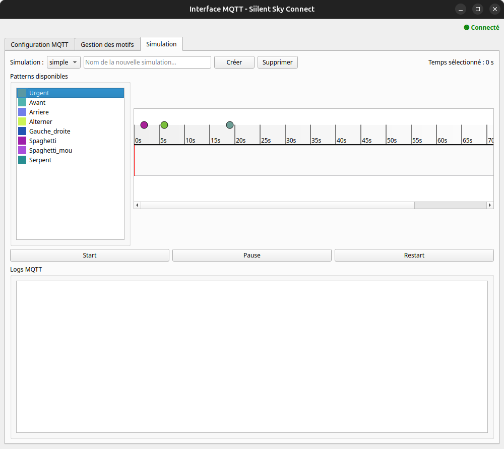

# Interface de Simulation  

La page **Simulation** permet de concevoir et d'exécuter des scénarios à partir des patterns définis dans la page **Patterns**. Ces scénarios sont représentés sous la forme d'une **timeline interactive**, où il est possible d'ajouter, modifier et supprimer des événements.

Si une connexion **MQTT** est établie, la simulation peut être exécutée en temps réel, avec un envoi des patterns directement vers le bracelet connecté.

## Création d'une Simulation  

Une simulation se compose d’une séquence de patterns placés à des moments précis sur la timeline. Pour en créer une :  

1. Entrer un **nom** dans le champ prévu à cet effet.  
2. Cliquer sur **Créer** pour générer une timeline vierge.  

Une fois créée, la timeline peut être enrichie en y ajoutant des patterns depuis la liste disponible à gauche de l’écran.

## Manipulation des Patterns  

Les patterns, définis et gérés dans la page **Patterns**, sont stockés dans un fichier JSON et apparaissent sous forme de **points colorés** sur la timeline.  

### Ajouter un Pattern  

Un pattern peut être ajouté sur la timeline par un **glisser-déposer (drag & drop)**. Il sera exécuté au moment précis où il est placé.  

### Modifier un Pattern  

Une fois sur la timeline, un pattern peut être déplacé horizontalement pour ajuster son timing d’exécution.  

### Supprimer un Pattern  

Un **double-clic** sur un pattern le supprime immédiatement de la timeline.  

## Exécution de la Simulation  

Les boutons situés en bas de l’interface permettent de contrôler l’exécution de la simulation :  

- **Start** : Démarre la lecture de la timeline.  
- **Pause** : Met temporairement la simulation en pause.  
- **Restart** : Réinitialise la simulation et la relance depuis le début.  

Lorsque la connexion **MQTT** est active, la simulation joue les patterns en temps réel et les envoie automatiquement au bracelet connecté.